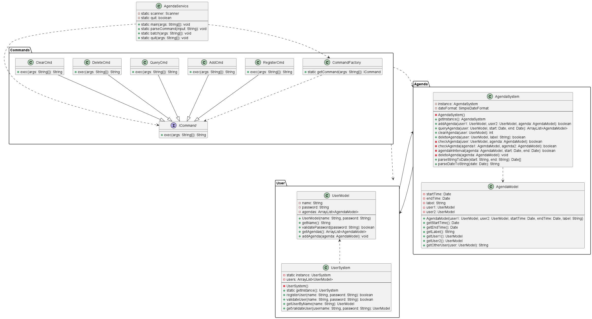

---
puppeteer:
    format: "A4"
    scale: 0.8
    margin:
        top: 1cm
        right: 1cm
        bottom: 1cm
        left: 1cm
print_background: true
---

[TOC]

## 设计文档  

### 1.需求分析  
* 开发一个基于命令行交互方式的议程管理系统  
* 已注册到系统的用户（user）可添加（add）、删除（delete）、查询（query）系统中记录的会议（meeting）安排  
* 提供新用户注册（register）、清除（clear）某一用户所有会议安排等管理功能   

### 2.主要模块
* 主程序`AgendaService.java`:与用户进行交互, 根据用户的输入来执行命令, 并输出命令执行的结果  
* `Agenda`程序包: 包含`AgendaModel`, 用于存储议程的数据. `AgendaSystem`采用单例模式, 提供具体的对用户议程的操作  
* `User`程序包: 包含`UserModel`, 用于存储用户的数据. `UserSystem`采用单例模式, 提供对用户的操作  
* `Commands`程序包: 包含`ICommand`接口, 约束命令必须实现`exec`方法. `CommandFactory`采用简单工厂模式, 根据输入产生对应的命令对象. 还包括各种命令对象, 用于执行相应的命令  

### 3.类设计  
**类图(UML)**

**主要类说明**  

`AgendaService` 类  
**功能**：程序入口，管理用户交互。
| 方法名 | 说明               |
|--------|------------------|
| `main(String[] args)` | 程序入口，获取用户输入 |
| `parseCommand(String input)` | 处理用户的输入并执行对应命令 |
| `batch(String[] args)` | 读取batch文件, 并逐行处理 |
| `quit(String[] args)` | 处理退出命令 |  

`AgendaModel` 类  
**功能**：封装议程数据
| 方法名 | 说明               |
|--------|------------------|
| `getOtherUser(UserModel user)` | 根据传入用户获取议程的另一位用户 |  

`AgendaSystem` 类  
**功能**：对议程进行处理
| 方法名 | 说明               |
|--------|------------------|
| `addAgenda(UserModel user1, UserModel user2, AgendaModel agenda)` | 为用户添加议程 |  
| `queryAgenda(UserModel user, Date start, Date end)` | 查询用户议程 |  
|`deleteAgenda(UserModel user, String label)`|删除用户对应label议程|
|`clearAgenda(UserModel user)`|清除用户议程|
|`dcheckAgenda(UserModel user, AgendaModel agenda)`|检测议程是否与用户冲突|
|`checkAgenda(AgendaModel agenda1, AgendaModel agenda2)`|检查两个议程是否冲突|
|`agendaInInterval(AgendaModel agenda, Date start, Date end)`|检查议程是否在一个时间段内|
|`deleteAgenda(AgendaModel agenda)`|从此议程的两个用户的议程列表中删除此议程|
|`parseStringToDate(String start, String end)`|将字符串时间转换为Date|
|`parseDateToString(Date date)`|将Data时间转换为字符串|

`UserModel` 类  
**功能**：封装用户数据
| 方法名 | 说明               |
|--------|------------------|
|`validataPassword(String password)`|验证用户密码|  
|`addAgenda(Agenda Model)`|添加议程到用户的议程列表|  

`UserSystem` 类  
**功能**：处理用户数据
| 方法名 | 说明               |
|--------|------------------|
|`registerUser(String name, String password)`|尝试进行注册|
|`validateUser(String name, String password)`|验证用户名和密码|
|`getUserByName(String name)`|根据用户名寻找用户|
|`getValidateUser(String name, String password)`|根据用户名和密码验证并返回用户|

`ICommand` 接口  
**功能**：规定命令约束
| 方法名 | 说明               |
|--------|------------------|
|`String exec(String[] args)`|命令执行|

`CommandFactory` 类   
**功能**: 生产对应命令  
| 方法名 | 说明               |
|--------|------------------|
|`getCommand(String[] args)`|根据参数返回对应命令对象|  

`XXXCmd` 类   
**功能**: 执行具体命令  
| 方法名 | 说明               |
|--------|------------------|
|`String exec(String[] args)`|执行具体命令, 返回执行消息|  

### 4.交互设计
- 用户启动程序，输入要执行的命令。  
- 程序执行成功返回对应信息, 执行失败返回失败原因。  
- 用户可以输入quit命令来退出程序。  

### 5.扩展性与可维护性
- 代码采用封装和模块化设计，易于扩展。  
- 采用了工厂模式以及命令接口约束便于以后新增命令的扩展, 新增命令时需要新增实现`ICommand`接口的命令类, 并且在`CommandFactory`中根据输入返回新的命令对象。  
- 使用了OOP的多态来简化主程序中的命令执行, 无论在`CommandFactory`中得到了什么命令对象, 只需要转换为`ICommand`并且调用`exec`方法即可  

### 6.测试

在`test`文件夹中对程序进行不同的测试, 具体见`test.pdf`文件  

### 7.部署及环境
- **编译环境**：JDK 8 及以上。
- **运行环境**：Java 虚拟机。
- **依赖项**：无额外依赖。

