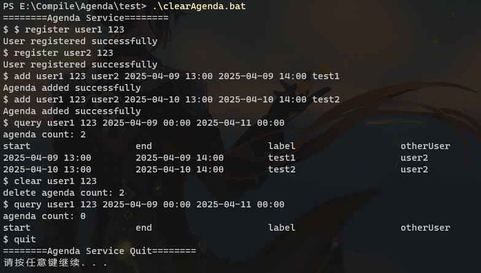
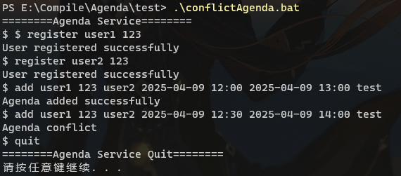
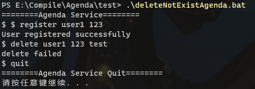
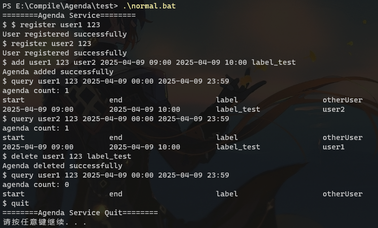
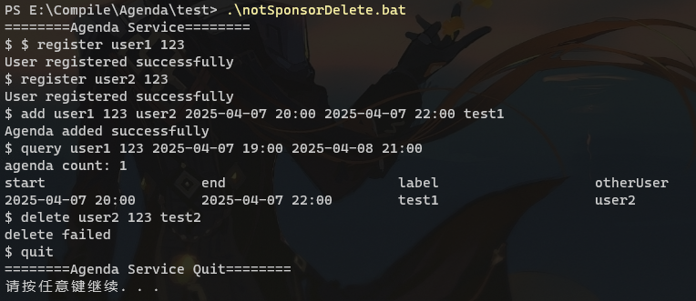
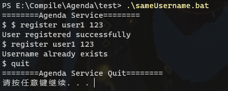
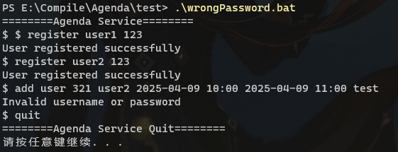

---
puppeteer:
    format: "A4"
    scale: 0.8
    margin:
        top: 1cm
        right: 1cm
        bottom: 1cm
        left: 1cm
print_background: true
---

[TOC]

### 测试用例  

#### 清除用户议程测试  
运行`test\clearAgenda.bat`  
结果:  
  
成功清除了添加的议程  

---

#### 添加冲突议程测试  
运行`test\conflictAgenda.bat`  
结果:  
  
无法添加时间冲突的议程

---

#### 删除不存在的label议程测试  
运行`test\deleteNotExistAgenda.bat`  
结果:  
  
删除失败

---

#### 正常注册/添加/查询/删除测试  
运行`test\normal.bat`  
结果:  
 
所以功能正常

---

#### 非议程注册者删除议程测试  
运行`test\notSponsorDelete.bat`  
结果:  
  
非议程注册者无法删除对应议程

---

#### 注册已存在用户名测试  
运行`test\sameUsername.bat`  
结果:  
  
注册失败

---

#### 用户输入错误密码测试  
运行`test\wrongPassword.bat`  
结果:  
   
错误的用户名, 无法执行命令
