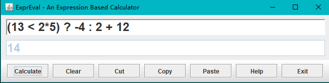
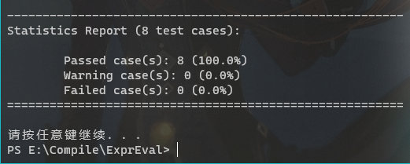
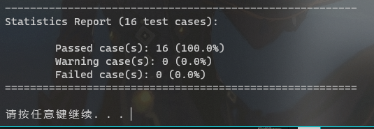
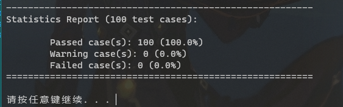

---
puppeteer:
    format: "A4"
    scale: 0.8
    margin:
        top: 1cm
        right: 1cm
        bottom: 1cm
        left: 1cm
print_background: true
---

[TOC]

## 设计文档  

### 1.二义性分析
 </img>  
要证明此语法定义存在二义性, 只需要找到一个句子能由两个不同的语法树构建  
如1+2+3  
 </img>  

### 2.词法分析的设计与实现
有限自动机(状态转换图)如下:  
 </img>  
其中[0-9]表示0-9中任意一个数字, 转换箭头上字符多于一个时表示任意一个字符都能进行转换.  

在词法分析中, 单词主要分为$, 数字, 布尔值, 函数和操作符. 在构造Token时将具体的单词存入`tokenString`中, 以便在需要时取出`tokenString`来区分具体是什么操作符/函数等.  

对于预定义函数和布尔值常量的识别, 先判断单词的第一个字符是否为预定义函数的开头字符或布尔值常量的开头字符. 再进一步判断是否能够完整匹配预定义函数和布尔值常量即可.  

在处理数值常量时主要参考上面的状态机来处理. 开头的字符如果是数字时, 进入`scanDecimal()`方法来处理数值常量. 先扫描整数部分. 如果后面有小数点, 则扫描小数点后的数字, 如无数字则抛出`IllegalDecimalException`(有小数点但没有小数部分), 并连接到存储的字符串中. 如果接下来是e/E, 说明有指数部分, 如果后面是+ -则记录指数的符号, 没有+ -则符号默认为+, 最后扫描指数部分的数字, 如无数字则`IllegalDecimalException`(有e/E但没有指数部分), 连接到存储的字符串中. 此字符串即一个规范的数值表示.  

在初始化Scanner时, 将表达式都转换为小写并使用`trim()`来去除开头与结尾的空格.  
在扫描完一个完整的token时, 由于token之间可以有空格, 所以要跳过当前token与下一个token的空格部分. 在`nextToken()`方法最开始使用`skipWhiteSpace()`来处理. 而在处理token的过程中空格是非法的, 会抛出对应的异常.  


### 3.算符优先关系定义
若此文法是OPG(算符优先文法)可以根据以下步骤来构造OPP  

首先构造非终结符的FIRSTVT和LASTVT  
对于非终结符P, 构造方法如下
* 若有产生式$P \rightarrow a...$或$P \rightarrow Qa...$, 则$a \in FIRSTVT(P)$  
* 若有产生式$P \rightarrow Q$, 则$FIRSTVT(Q) \subset FIRSTVT(P)$  
* 若有产生式$P \rightarrow ...a$或$P \rightarrow ...aQ$, 则$a \in LASTVT(P)$  
* 若有产生式$P \rightarrow ...Q$, 则$LASTVT(Q) \subset LASTVT(P)$  
非现不考虑递归情况, 各产生式的FIRSTVT终结符(红框)和LASTVT终结符(蓝圈)如下  
</img>  
据此构造FIRSTVT和LASTVT  
其中
* relation表示< >= < <= <>  
* bool表示 true false
* func表示 sin cos max min

| 非终结符 | FIRSTVT | LASTVT |
|:-:|:-:|:-:|
| Expr | $ | $ |
| ArithExpr | decimal ( + - * / ^ unary- ? bool relation & \| ! func | decimal ) + - * / ^ unary- : |
| UnaryFunc | sin cos | ) |
| VariablFunc | max min | ) |
| ArithExprList | decimal ( + - * / ^ unary- ? bool relation & \| ! func , | decimal ) + - * / ^ unary- : , |
| BoolExpr | decimal ( + - * / ^ unary- ? bool relation & \| ! func | bool ) relation & \| ! decimal ) + - * / ^ unary- : |

然后根据以下规则确定算符优先级
* 对于形如$R \rightarrow ...ab...$或$R \rightarrow ...aQb...$的产生式, 有a=b(shift)  
* 对于形如$R \rightarrow ...aP...$的产生式, 有$b \in FIRSTVT(P)$, 则a<b(shift)  
* 对于形如$R \rightarrow ...Pb...$的产生式, 有$a \in LASTVT(P)$, 则a>b(reduce)  
此外, 由于文法开始符为Expr, 所以有\$Expr\$存在, 得到\$ = \$, \$ < FIRSTVT(Expr), LASTVT(Expr) > \$  

例: 对于 `+ ArithExpr`, 可以得到 + < FIRSTVT(ArithExpr)  
而对于`ArithExpr *`, 可得到 LASTVT(ArithExpr) > *  
此时存在 + < *, + > *. 不满足两个运算符间无关系或只有一种关系. **所以此文法不是OPG文法**, 不能使用上述方法来构造OPP.  


在具体构造OPP表时, 有如下约定  
<font color=00aa00>0: shift</font>  
<font color=0055ff>1: reduce</font>  
2: acc  
<font color=ff0000>3: MissingOperator Exception</font>  
<font color=ff8800>4: Missing Operand Exception</font>  
<font color=ff0088>5: Missing Left Parenthesis Exception</font>  
<font color=ff8088>6: Missing Right Parenthesis Exception</font>  
<font color=ff88ff>7: Function Call Exception</font>  
<font color=ff55ff>8: Trinary Operation Exception</font>  
<font color=ffbb88>9: Type Mismatched Exception</font>  
OPP表如下:  

| | decimal | bool | ( | ) | func | unary - | ^ | * / | + - | relation | ! | & | \| | ? | : | , | \$ |
|:-:|:-:|:-:|:-:|:-:|:-:|:-:|:-:|:-:|:-:|:-:|:-:|:-:|:-:|:-:|:-:|:-:|:-:|
| <b>decimal |<font color=ff0000>3</font>  |<font color=ff0000>3</font>  |<font color=ff0000>3</font>  |<font color=0055ff>1</font>  |<font color=ff0000>3</font>  |<font color=ff0000>3</font>  |<font color=0055ff>1</font>  |<font color=0055ff>1</font>  |<font color=0055ff>1</font>  |<font color=0055ff>1</font>  |<font color=ffbb88>9</font>  |<font color=0055ff>1</font>  |<font color=0055ff>1</font>  |<font color=0055ff>1</font>  |<font color=0055ff>1</font>  |<font color=0055ff>1</font>  |<font color=0055ff>1</font>  |
| <b>bool|<font color=ff0000>3</font>  |<font color=ff0000>3</font>  |<font color=ff0000>3</font>  |<font color=0055ff>1</font>  |<font color=ff0000>3</font>  |<font color=ff0000>3</font>  |<font color=0055ff>1</font>  |<font color=0055ff>1</font>  |<font color=0055ff>1</font>  |<font color=0055ff>1</font>  |<font color=ff0000>3</font>  |<font color=0055ff>1</font>  |<font color=0055ff>1</font>  |<font color=0055ff>1</font>  |<font color=0055ff>1</font>  |<font color=0055ff>1</font>  |<font color=0055ff>1</font>  |
| <b>( | <font color=00aa00>0</font>   | <font color=00aa00>0</font>   | <font color=00aa00>0</font>   | <font color=00aa00>0</font>   | <font color=00aa00>0</font>   | <font color=00aa00>0</font>   | <font color=00aa00>0</font>   | <font color=00aa00>0</font>   | <font color=00aa00>0</font>   | <font color=00aa00>0</font>   | <font color=00aa00>0</font>   | <font color=00aa00>0</font>   | <font color=00aa00>0</font>   | <font color=00aa00>0</font>   |<font color=ff55ff>8</font>  | <font color=00aa00>0</font>   |<font color=ff8088>6</font>  |
| <b>) |<font color=ff0000>3</font>  |<font color=ff0000>3</font>  |<font color=ff0000>3</font>  |<font color=0055ff>1</font>  |<font color=ff0000>3</font>  |<font color=ff0000>3</font>  |<font color=0055ff>1</font>  |<font color=0055ff>1</font>  |<font color=0055ff>1</font>  |<font color=0055ff>1</font>  |<font color=ff0000>3</font>  |<font color=0055ff>1</font>  |<font color=0055ff>1</font>  |<font color=0055ff>1</font>  |<font color=0055ff>1</font>  |<font color=0055ff>1</font>  |<font color=0055ff>1</font>  |
| <b>func|<font color=ff88ff>7</font>  |<font color=ff88ff>7</font>  | <font color=00aa00>0</font>   |<font color=ff0088>5</font>  |<font color=ff0088>5</font>  |<font color=ff0088>5</font>  |<font color=ff0088>5</font>  |<font color=ff0088>5</font>  |<font color=ff0088>5</font>  |<font color=ff0088>5</font>  |<font color=ff0088>5</font>  |<font color=ff0088>5</font>  |<font color=ff0088>5</font>  |<font color=ff0088>5</font>  |<font color=ff0088>5</font>  |<font color=ff0088>5</font>  |<font color=ff0088>5</font>  |
| <b>unary - | <font color=00aa00>0</font>   | <font color=00aa00>0</font>   | <font color=00aa00>0</font>   |<font color=0055ff>1</font>  | <font color=00aa00>0</font>   | <font color=00aa00>0</font>   |<font color=0055ff>1</font>  |<font color=0055ff>1</font>  |<font color=0055ff>1</font>  |<font color=0055ff>1</font>  |<font color=0055ff>1</font>  |<font color=0055ff>1</font>  |<font color=0055ff>1</font>  |<font color=0055ff>1</font>  |<font color=0055ff>1</font>  |<font color=0055ff>1</font>  |<font color=0055ff>1</font>  |
| <b>^ | <font color=00aa00>0</font>   | <font color=00aa00>0</font>   | <font color=00aa00>0</font>   |<font color=0055ff>1</font>  | <font color=00aa00>0</font>   | <font color=00aa00>0</font>   | <font color=00aa00>0</font>   |<font color=0055ff>1</font>  |<font color=0055ff>1</font>  |<font color=0055ff>1</font>  |<font color=ffbb88>9</font>  |<font color=0055ff>1</font>  |<font color=0055ff>1</font>  |<font color=0055ff>1</font>  |<font color=0055ff>1</font>  |<font color=0055ff>1</font>  |<font color=0055ff>1</font>  |
| <b>* / | <font color=00aa00>0</font>   | <font color=00aa00>0</font>   | <font color=00aa00>0</font>   |<font color=0055ff>1</font>  | <font color=00aa00>0</font>   | <font color=00aa00>0</font>   | <font color=00aa00>0</font>   |<font color=0055ff>1</font>  |<font color=0055ff>1</font>  |<font color=0055ff>1</font>  |<font color=ffbb88>9</font>  |<font color=0055ff>1</font>  |<font color=0055ff>1</font>  |<font color=0055ff>1</font>  |<font color=0055ff>1</font>  |<font color=0055ff>1</font>  |<font color=0055ff>1</font>  |
| <b>+ - | <font color=00aa00>0</font>   | <font color=00aa00>0</font>   | <font color=00aa00>0</font>   |<font color=0055ff>1</font>  | <font color=00aa00>0</font>   | <font color=00aa00>0</font>   | <font color=00aa00>0</font>   | <font color=00aa00>0</font>   |<font color=0055ff>1</font>  |<font color=0055ff>1</font>  |<font color=ffbb88>9</font>  |<font color=0055ff>1</font>  |<font color=0055ff>1</font>  |<font color=0055ff>1</font>  |<font color=0055ff>1</font>  |<font color=0055ff>1</font>  |<font color=0055ff>1</font>  |
| <b>relation | <font color=00aa00>0</font>   | <font color=00aa00>0</font>   | <font color=00aa00>0</font>   |<font color=0055ff>1</font>  | <font color=00aa00>0</font>   | <font color=00aa00>0</font>   | <font color=00aa00>0</font>   | <font color=00aa00>0</font>   | <font color=00aa00>0</font>   |<font color=0055ff>1</font>  |<font color=ff0000>3</font>  |<font color=0055ff>1</font>  |<font color=0055ff>1</font>  |<font color=0055ff>1</font>  |<font color=ffbb88>9</font>  |<font color=ffbb88>9</font>  |<font color=0055ff>1</font>  |
| <b>! | <font color=00aa00>0</font>   | <font color=00aa00>0</font>   | <font color=00aa00>0</font>   |<font color=0055ff>1</font>  | <font color=00aa00>0</font>   | <font color=00aa00>0</font>   | <font color=00aa00>0</font>   | <font color=00aa00>0</font>   | <font color=00aa00>0</font>   | <font color=00aa00>0</font>   | <font color=00aa00>0</font>   |<font color=0055ff>1</font>  |<font color=0055ff>1</font>  |<font color=0055ff>1</font>  |<font color=0055ff>1</font>  |<font color=ffbb88>9</font>  |<font color=0055ff>1</font>  |
| <b>& | <font color=00aa00>0</font>   | <font color=00aa00>0</font>   | <font color=00aa00>0</font>   |<font color=0055ff>1</font>  | <font color=00aa00>0</font>   | <font color=00aa00>0</font>   | <font color=00aa00>0</font>   | <font color=00aa00>0</font>   | <font color=00aa00>0</font>   | <font color=00aa00>0</font>   | <font color=00aa00>0</font>   |<font color=0055ff>1</font>  |<font color=0055ff>1</font>  |<font color=0055ff>1</font>  |<font color=0055ff>1</font>  |<font color=ffbb88>9</font>  |<font color=0055ff>1</font>  |
| <b>\| | <font color=00aa00>0</font>   | <font color=00aa00>0</font>   | <font color=00aa00>0</font>   |<font color=0055ff>1</font>  | <font color=00aa00>0</font>   | <font color=00aa00>0</font>   | <font color=00aa00>0</font>   | <font color=00aa00>0</font>   | <font color=00aa00>0</font>   | <font color=00aa00>0</font>   | <font color=00aa00>0</font>   | <font color=00aa00>0</font>   |<font color=0055ff>1</font>  |<font color=0055ff>1</font>  |<font color=0055ff>1</font>  |<font color=ffbb88>9</font>  |<font color=0055ff>1</font>  |
| <b>? | <font color=00aa00>0</font>   | <font color=00aa00>0</font>   | <font color=00aa00>0</font>   |<font color=ff55ff>8</font>  | <font color=00aa00>0</font>   | <font color=00aa00>0</font>   | <font color=00aa00>0</font>   | <font color=00aa00>0</font>   | <font color=00aa00>0</font>   | <font color=00aa00>0</font>   | <font color=00aa00>0</font>   | <font color=00aa00>0</font>   | <font color=00aa00>0</font>   | <font color=00aa00>0</font>   | <font color=00aa00>0</font>   | <font color=00aa00>0</font>   |<font color=ff55ff>8</font>  |
| <b>: | <font color=00aa00>0</font>   | <font color=00aa00>0</font>   | <font color=00aa00>0</font>   |<font color=0055ff>1</font>  | <font color=00aa00>0</font>   | <font color=00aa00>0</font>   | <font color=00aa00>0</font>   | <font color=00aa00>0</font>   | <font color=00aa00>0</font>   | <font color=00aa00>0</font>   | <font color=00aa00>0</font>   | <font color=00aa00>0</font>   | <font color=00aa00>0</font>   | <font color=00aa00>0</font>   |<font color=0055ff>1</font>  |<font color=0055ff>1</font>  |<font color=0055ff>1</font>  |
| <b>, | <font color=00aa00>0</font>   | <font color=00aa00>0</font>   | <font color=00aa00>0</font>   | <font color=00aa00>0</font>   | <font color=00aa00>0</font>   | <font color=00aa00>0</font>   | <font color=00aa00>0</font>   | <font color=00aa00>0</font>   | <font color=00aa00>0</font>   | <font color=00aa00>0</font>   | <font color=00aa00>0</font>   | <font color=00aa00>0</font>   | <font color=00aa00>0</font>   | <font color=00aa00>0</font>   | <font color=00aa00>0</font>   | <font color=00aa00>0</font>   |<font color=ff8088>6</font>  |
| <b>\$ | <font color=00aa00>0</font>   | <font color=00aa00>0</font>   | <font color=00aa00>0</font>   |<font color=ff0088>5</font>  | <font color=00aa00>0</font>   | <font color=00aa00>0</font>   | <font color=00aa00>0</font>   | <font color=00aa00>0</font>   | <font color=00aa00>0</font>   | <font color=00aa00>0</font>   | <font color=00aa00>0</font>   | <font color=00aa00>0</font>   | <font color=00aa00>0</font>   | <font color=00aa00>0</font>   |<font color=ff55ff>8</font>  | <font color=00aa00>0</font>   | 2 |

一般来说, 高优先级运算符遇到低优先级运算符采用reduce操作, 低优先级操作符遇到高优先级操作符则采用shift操作.  
当运算符优先级相等时, 左结合的运算符采用reduce操作, 右结合的运算符采用shift操作.  

具体来说  
* 一元取负运算符的优先级高于二元减法运算符的优先级  
* 三元运算符的优先级小于绝大部分运算符, 仅大于),$  
* 预定义函数后面必须是左括号, 遇到其他运算符都会抛出异常  

在Scanner读取到-时, 要区分是一元取负运算符还是二元减法运算符. 如果-前面有操作数的话, 就可以认为是二元减法运算符, 否则为一元取负运算符. 在实现时, Scanner使用一个`prevTokenType`来记录上一个token的类型. 如果`prevTokenType`满足`ETokenType.DECIMAL || ETokenType.RPAREN || ETokenType.BOOL`, 则认为上一个token为操作数, 当前-表示二元取反运算符.  


### 4.语法分析与语义处理的设计与实现

OPP核心控制由`stack`的栈顶token类型和`lookahead`的token类型来决定. 先根据上面两个token的类型在OPP表中查询到值. 再根据定义的`值 -> 动作`来执行相应的动作(移进, 归约等). 核心算法如下:  
```java
public double parse() throws ExpressionException {
    lookahead = scanner.nextToken();
    while(true){
        switch (getOPP()) {
            case 0 -> shift();
            case 1 -> reduce();
            case 2 -> {
                return accept();
            }
            case 3 -> throw new MissingOperatorException();
            case 4 -> throw new MissingOperandException();
            case 5 -> throw new MissingLeftParenthesisException();
            case 6 -> throw new MissingRightParenthesisException();
            case 7 -> throw new FunctionCallException();
            case 8 -> throw new TrinaryOperationException();
            case 9 -> throw new TypeMismatchedException();
        }
    }
}

private int getOPP() {
    return oppTable[getTopToken().getTokenType().ordinal()][lookahead.getTokenType().ordinal()];
}
```
在Reduce过程中, 根据栈顶的Token即终结符来进行不同的规约过程. 各类归约使用的产生式如下注释:  
```java
public void reduce() throws ExpressionException {
    Token top = getTopTerminal();
    switch (top.getTokenType()) {
        // ArithExpr -> decimal
        case ETokenType.DECIMAL -> reduceDecimal();
        // BoolExpr -> true | false
        case ETokenType.BOOL -> reduceBool();
        // ArithExpr -> (ArithExpr) | sin(ArithExpr) | cos(ArithExpr)
        // ArithExpr -> max(ArithExpr, ArithExprList) | min(ArithExpr, ArithExprList)
        // BoolExpr -> (BoolExpr)
        case ETokenType.RPAREN -> reduceRightParen();
        // ArithExpr -> -ArithExpr
        case ETokenType.NEG -> reduceNeg();
        // ArithExpr -> ArithExpr +-/*^ ArithExpr
        // BoolExpr -> ArithExpr > >= < <= = <> ArithExpr
        case ETokenType.POWER, ETokenType.MUL_DIV, ETokenType.ADD_SUB, ETokenType.RELATION -> reduceBinaryDecimalOperator();
        // BoolExpr -> !BoolExpr
        case ETokenType.NOT -> reduceNot();
        // BoolExpr -> BoolExpr & | BoolExpr
        case ETokenType.AND, ETokenType.OR -> reduceAndOr();
        // ArithExpr -> BoolExpr ? ArithExpr : ArithExpr
        case ETokenType.COLON -> reduceTrinaryOperator();
    }
}
```
类型的兼容性检查和类型的推导是使用Expr来进行, 非终结符分为`ArithExpr`, `ArithExprList`和`BoolExpr`. 由于将非终结符和终结符都存储在一个栈中. 所以需要Expr与Token都实现`Symbol`接口, 然后使用`ArrayList<Symbol> stack`作为栈. 这里不使用`Stack`而是选择了`ArrayList`, 自己实现`getTopToken`和`getTopExpr`以便获取栈顶的终结符和非终结符.  


### 5.程序运行的屏幕截图
 </img>  
测试  
simple:  
 </img>  
standard:  
 </img>  
mytest 100个测试用例:  
 </img>  


### 6.实验的心得体会
在本实验中, 我对OPP表有更深刻的理解, OPP表的构造直接影响了Parser的操作, 从而直接影响到整个程序的运行结果. 此外, 我也实现了各种归约的具体实现, 归约的过程要根据栈中的内容进行判断, 是使用哪个产生式进行归约, 或是要抛出什么样的异常等等. 在本实验中我认识到异常对程序的重要性, 精确的异常类型能更容易判断是哪里出现了问题.  


