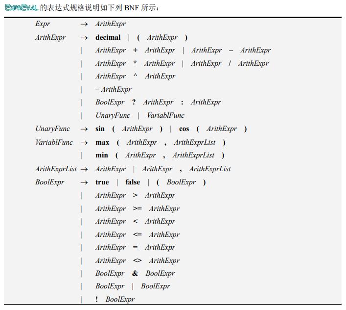
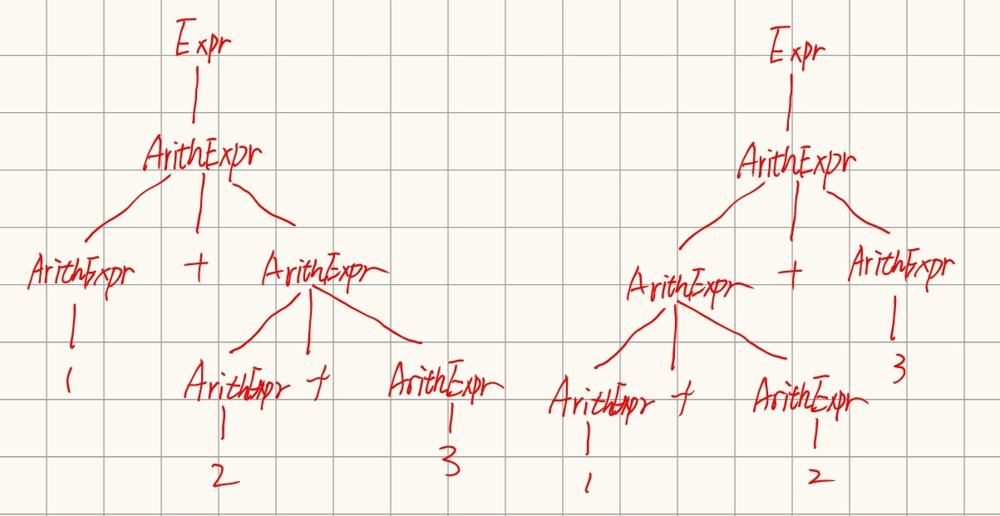
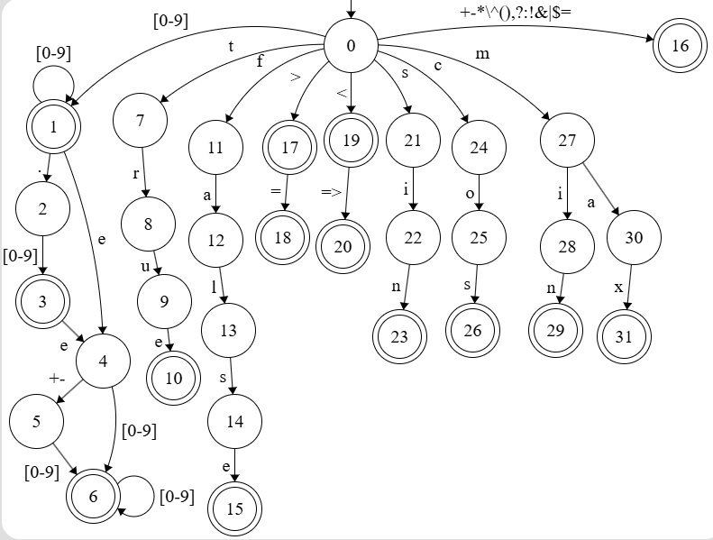
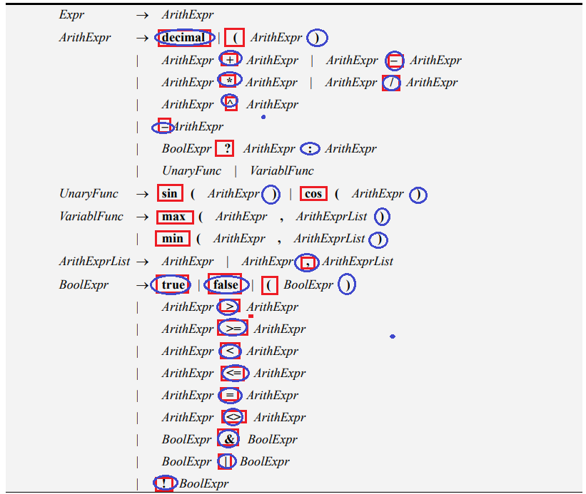

---
puppeteer:
    format: "A4"
    scale: 0.8
    margin:
        top: 1cm
        right: 1cm
        bottom: 1cm
        left: 1cm
print_background: true
---

[TOC]

## 设计文档  

### 二义性分析
 </img>  
要证明此语法定义存在二义性, 只需要找到一个句子能由两个不同的语法树构建  
如1+2+3  
 </img>  

### 词法分析的设计与实现
有限自动机(状态转换图)如下:  
 </img>  
其中[0-9]表示0-9中任意一个数字, 转换箭头上字符多于一个时表示任意一个字符都能进行转换.  

### 算符优先关系定义
若此文法是OPG(算符优先文法)可以根据以下步骤来构造OPP  

首先构造非终结符的FIRSTVT和LASTVT  
对于非终结符P, 构造方法如下
* 若有产生式$P \rightarrow a...$或$P \rightarrow Qa...$, 则$a \in FIRSTVT(P)$  
* 若有产生式$P \rightarrow Q$, 则$FIRSTVT(Q) \subset FIRSTVT(P)$  
* 若有产生式$P \rightarrow ...a$或$P \rightarrow ...aQ$, 则$a \in LASTVT(P)$  
* 若有产生式$P \rightarrow ...Q$, 则$LASTVT(Q) \subset LASTVT(P)$  
非现不考虑递归情况, 各产生式的FIRSTVT终结符(红框)和LASTVT终结符(蓝圈)如下  
</img>  
据此构造FIRSTVT和LASTVT  
其中
* relation表示< >= < <= <>  
* bool表示 true false
* func表示 sin cos max min

| 非终结符 | FIRSTVT | LASTVT |
|:-:|:-:|:-:|
| Expr | $ | $ |
| ArithExpr | decimal ( + - * / ^ unary- ? bool relation & \| ! func | decimal ) + - * / ^ unary- : |
| UnaryFunc | sin cos | ) |
| VariablFunc | max min | ) |
| ArithExprList | decimal ( + - * / ^ unary- ? bool relation & \| ! func , | decimal ) + - * / ^ unary- : , |
| BoolExpr | decimal ( + - * / ^ unary- ? bool relation & \| ! func | bool ) relation & \| ! decimal ) + - * / ^ unary- : |

然后根据以下规则确定算符优先级
* 对于形如$R \rightarrow ...ab...$或$R \rightarrow ...aQb...$的产生式, 有a=b(shift)  
* 对于形如$R \rightarrow ...aP...$的产生式, 有$b \in FIRSTVT(P)$, 则a<b(shift)  
* 对于形如$R \rightarrow ...Pb...$的产生式, 有$a \in LASTVT(P)$, 则a>b(reduce)  
此外, 由于文法开始符为Expr, 所以有\$Expr\$存在, 得到\$ = \$, \$ < FIRSTVT(Expr), LASTVT(Expr) > \$  

例: 对于 `+ ArithExpr`, 可以得到 + < FIRSTVT(ArithExpr)  
而对于`ArithExpr *`, 可得到 LASTVT(ArithExpr) > *  
此时存在 + < *, + > *. 不满足两个运算符间无关系或只有一种关系. **所以此文法不是OPG文法**, 不能使用上述方法来构造OPP.  

0: shift  
1: reduce  
2: acc  
3: MissingOperator Exception  
4: Missing Operand Exception  
5: Missing Left Parenthesis Exception  
6: Missing Right Parenthesis Exception  
7: Function Call Exception  
8: Trinary Operation Exception  
9: Type Mismatched Exception  

| | decimal | bool | ( | ) | func | unary - | ^ | * / | + - | relation | ! | & | \| | ? | : | , | \$ |
|:-:|:-:|:-:|:-:|:-:|:-:|:-:|:-:|:-:|:-:|:-:|:-:|:-:|:-:|:-:|:-:|:-:|:-:|
| <b>decimal |3  |3  |3  |1  |3  |3  |1  |1  |1  |1  |9  |1  |1  |1  |1  |1  |1  |
| <b>bool|3  |3  |3  |1  |3  |3  |1  |1  |1  |1  |3  |1  |1  |1  |1  |1  |1  |
| <b>( | 0   | 0   | 0   | 0   | 0   | 0   | 0   | 0   | 0   | 0   | 0   | 0   | 0   | 0   |8  | 0   |6  |
| <b>) |3  |3  |3  |1  |3  |3  |1  |1  |1  |1  |3  |1  |1  |1  |1  |1  |1  |
| <b>func|7  |7  | 0   |5  |5  |5  |5  |5  |5  |5  |5  |5  |5  |5  |5  |5  |5  |
| <b>unary - | 0   | 0   | 0   |1  | 0   | 0   |1  |1  |1  |1  |1  |1  |1  |1  |1  |1  |1  |
| <b>^ | 0   | 0   | 0   |1  | 0   | 0   | 0   |1  |1  |1  |9  |1  |1  |9  |1  |1  |1  |
| <b>* / | 0   | 0   | 0   |1  | 0   | 0   | 0   |1  |1  |1  |9  |1  |1  |1  |1  |1  |1  |
| <b>+ - | 0   | 0   | 0   |1  | 0   | 0   | 0   | 0   |1  |1  |9  |1  |1  |9  |1  |1  |1  |
| <b>relation | 0   | 0   | 0   |1  | 0   | 0   | 0   | 0   | 0   |1  |3  |1  |1  |1  |9  |9  |1  |
| <b>! | 0   | 0   | 0   |1  | 0   | 0   | 0   | 0   | 0   | 0   | 0   |1  |1  |1  |1  |9  |1  |
| <b>& | 0   | 0   | 0   |1  | 0   | 0   | 0   | 0   | 0   | 0   | 0   |1  |1  |1  |1  |9  |1  |
| <b>\| | 0   | 0   | 0   |1  | 0   | 0   | 0   | 0   | 0   | 0   | 0   | 0   |1  |1  |1  |9  |1  |
| <b>? | 0   | 0   | 0   |8  | 0   | 0   | 0   | 0   | 0   | 0   | 0   | 0   | 0   | 0   | 0   | 0   |8  |
| <b>: | 0   | 0   | 0   |1  | 0   | 0   | 0   | 0   | 0   | 0   | 0   | 0   | 0   | 0   |1  |1  |1  |
| <b>, | 0   | 0   | 0   | 0   | 0   | 0   | 0   | 0   | 0   | 0   | 0   | 0   | 0   | 0   | 0   | 0   |6  |
| <b>\$ | 0   | 0   | 0   |5  | 0   | 0   | 0   | 0   | 0   | 0   | 0   | 0   | 0   | 0   |8  | 0   | 2 |

### 语法分析与语义处理的设计与实现

### 程序运行的屏幕截图

### 实验的心得体会

