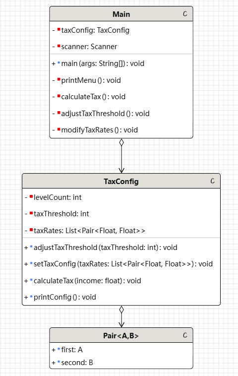

---
puppeteer:
    format: "A4"
    scale: 0.8
    margin:
        top: 1cm
        right: 1cm
        bottom: 1cm
        left: 1cm
print_background: true
---

[TOC]

## 设计文档  

### 1.需求分析  
* 根据用户输入的当月工资薪金来计算应缴纳的个人所得税  
* 支持对个人所得税起征点进行调整  
* 允许对个人所得税的各级税率修改  
* 使用命令行菜单让用户选择所需的功能

### 2.主要模块
* 主程序`Main.java`:与用户进行交互, 根据用户的输入来执行特定功能  
* 税率配置`TaxConfig.java`:保存个人所得税起征点, 各级税率等数据. 提供修改起征点, 修改税率和根据数据计算个人所得税方法.  
* `Pair.java`: 保存各级税率的数据结构. 对应应纳所得税额和税率

### 3.类设计  
**类图(UML)**

**主要类说明**  
`Main` 类  

**功能**：程序入口，管理用户交互。

| 方法名 | 说明               |
|--------|------------------|
| `main(String[] args)` | 程序入口，处理用户输入和菜单操作 |
| `printMenu()` | 显示操作菜单           |
| `calculateTax()` | 计算税收             |
| `adjustTaxThreshold()` | 修改起征点            |
| `modifyTaxRates()` | 修改税率             |
| `getInput(Class<T> type)` | 获取用户输入为特定类型      |

`TaxConfig` 类  

**功能**：管理税收计算和配置。

| 方法名 | 说明 |
|--------|------|
| `adjustTaxThreshold(int taxThreshold)` | 调整起征点 |
| `setTaxConfig(List<Pair<Float, Float>> taxRates)` | 设置税率配置 |
| `calculateTax(float income)` | 计算税额 |
| `printTaxConfig()` | 输出当前税收配置 |

`Pair<A, B>` 类  

**功能**：泛型数据结构，存储两元素的值。

| 方法名 | 说明 |
|--------|------|
| `Pair(A first, B second)` | 构造方法，初始化数据 |

### 4.交互设计
- 用户启动程序，选择功能。
- 用户输入收入，计算税额。
- 用户可修改起征点。
- 用户可修改税率配置。
- 用户可以随时退出程序。

### 5.扩展性与可维护性
- 代码采用封装和模块化设计，易于扩展。
- `TaxConfig` 可扩展以支持不同国家的税收规则。
- `Pair` 泛型类可复用，提高代码通用性。

### 6.测试
**单元测试**：对 `calculateTax()` 进行测试。  
在`test.bat`中对阈值以下以及对应各级的薪资进行个人所得税计算测试  

### 7.部署及环境
- **编译环境**：JDK 8 及以上。
- **运行环境**：Java 虚拟机。
- **依赖项**：无额外依赖。

