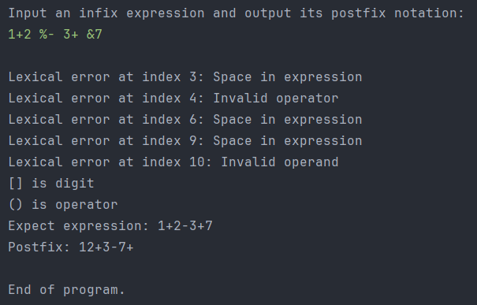
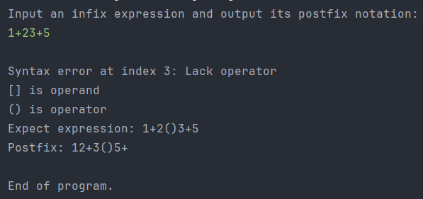
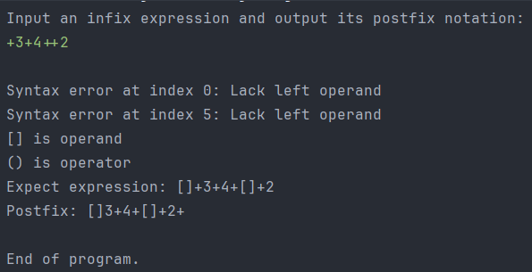
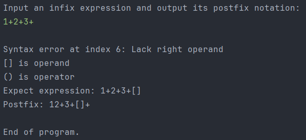
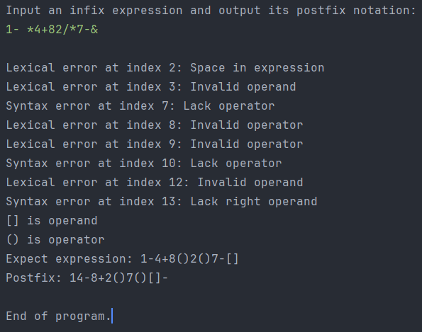

---
puppeteer:
    format: "A4"
    scale: 0.8
    margin:
        top: 1cm
        right: 1cm
        bottom: 1cm
        left: 1cm
print_background: true
---

[TOC]

## 设计文档  

### Step 1. 静态成员与非静态成员  
静态成员与非静态成员的区别: 静态成员变量被所有的对象实例共享, 在内存中只有一份. 而非静态成员则是每一个对象都有自己的数据, 不同对象的该成员变量互不影响  
本程序中只有一个`Parser`对象, 所以静态与非静态没有什么区别.  

如果将`lookahead`定义为非静态的, 不会影响程序的正确性  

看法: 如果不同对象要共享某个数据, 则将该数据声明为`static`. 本程序无此需求, 所以不应该声明为`static`  


### Step 2. 消除尾递归  
如下, 将尾递归转换为循环  
```java
void rest() throws IOException {
    while(lookahead == '+' || lookahead == '-') {
        int op = lookahead;
        match(operator);
        term();
        System.out.write(op);
    }
}
```

**理论分析**, 递归程序需要函数调用栈的额外空间开销, 并且还需要额外的函数调用时间开销(保存返回值地址, 参数压栈等), 消除递归后可以节省以上开销.  
复杂度如下  
||时间复杂度|空间复杂度|
|:-:|:-:|:-:|
|尾递归|O(n)|O(n)|
|消除尾递归|O(n)|O(1)|

**实验验证**: 编写一个简单的python程序来生成输入的中缀表达式, 长度分别为10, 100, ..., 1000000  
在原程序中添加计时代码, 程序运行完毕后输出运行时间.  
```java
long startTime = System.currentTimeMillis();
new Parser().expr();
long endTime = System.currentTimeMillis();
System.out.println("\nExecution time: " + (endTime - startTime) + " ms");
```
注意, 程序的输出一般会占用大量的运行时间, 所以在测试时将`Parser`类中的**输出语句全部注释**, 以正确测量程序的运行时间  
结果如下  
|输入长度|尾递归|消除尾递归|
|:-:|:-:|:-:|
|10|8ms|8ms|
|100|0ms|1ms|
|1000|2ms|1ms|
|10000|StackOverflow/5ms|4ms|
|100000|StackOverflow/20ms|9ms|
|1000000|StackOverflow/82ms|38ms|
|10000000|StackOverflow/666ms|311ms|

在运行时不添加额外命令时, 递归程序在输入长度为10000时就发生了栈溢出. 运行时使用`-Xss1024m`指令来扩大栈空间, 以使递归程序能够继续执行.  
可以看到在较大数据上, 消除尾递归的运行时间有明显的提升  


### Step 3. 为程序扩展错误处理功能  
首先添加一些成员变量便于处理错误  
```java
int index;  // 输入字符下标, 用于错误定位
ArrayList<String> errors;   // 错误信息
StringBuffer infix;  // 处理错误后的中缀表达式
StringBuffer answer;  // 处理错误后的后缀表达式
```
在`expr()`方法中, 处理完成后如果`errors`不为空则输出错误信息和期望的中缀表达式  
```java
if(!errors.isEmpty()) {
    System.out.println();
    for(String e : errors) {
        System.out.println(e);
    }
    System.out.println("[] is digit");
    System.out.println("() is operator");
    System.out.println("Expect expression: " + infix);
}
```
在`rest()`方法中预期lookahead为+,-运算符  
* 如果匹配到数字则发生语法错误: 缺少运算符. 补齐一个运算符后继续向后分析  
* 如果匹配到空格则发生词法错误, 跳过空格  
* 如果匹配到其他字符则发生词法错误: 无效的运算符, 并跳过此字符  

在`term()`方法中预期lookahead为操作数  
* 如果匹配到+,-运算符则发生语法错误: 缺少左操作数, 补齐操作数后继续分析  
* 如果匹配到换行符则发生语法错误: 缺少右操作数, 补齐操作数  
* 如果匹配到空格则发生词法错误, 跳过空格  
* 如果匹配到其他字符则发生词法错误: 无效的操作数, 并跳过此字符  

#### 用例截图:  
**词法错误:**  
  
**语法错误:**  
缺少运算符:  
  
缺少左操作数:  
  
缺少右操作数:  
  

**综合测试:**  
  

