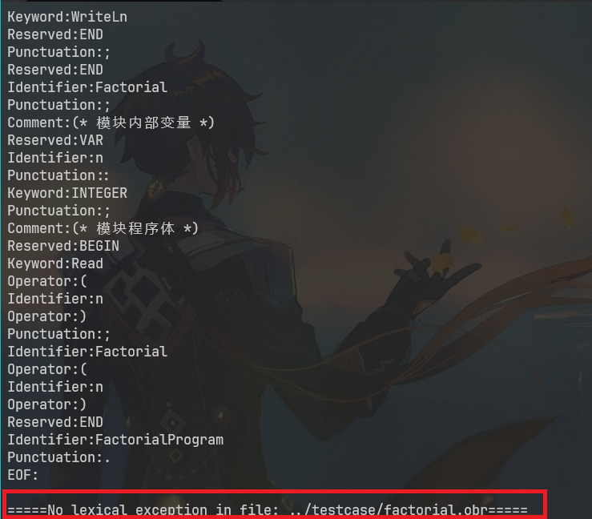
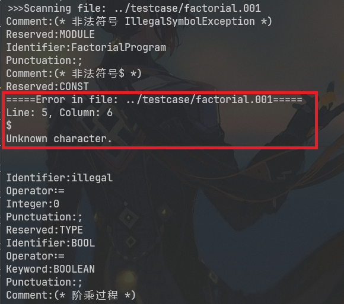
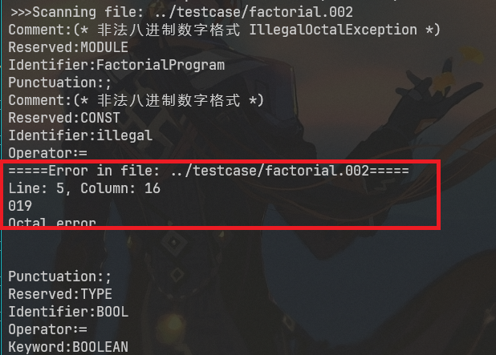
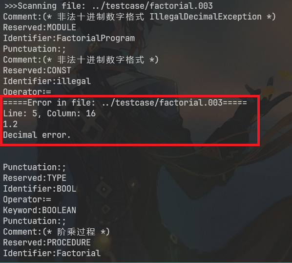
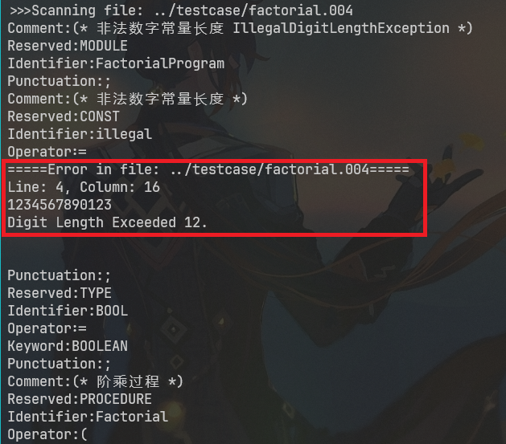
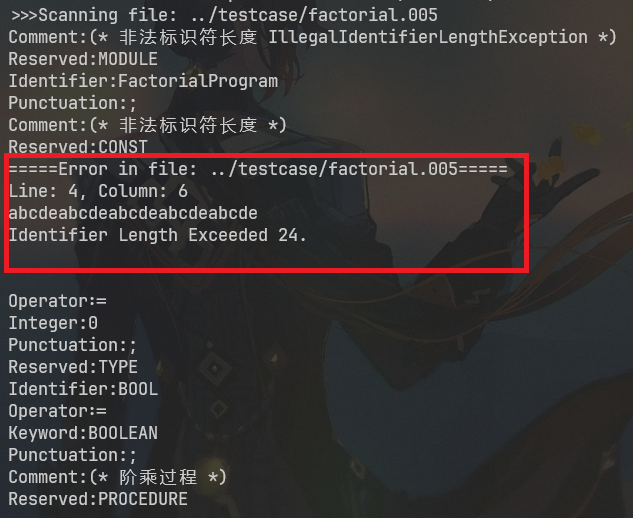
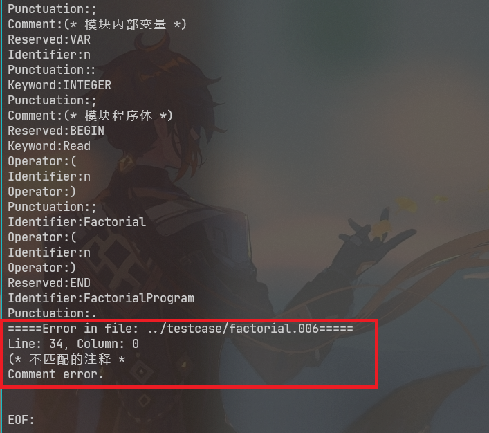

---
puppeteer:
    format: "A4"
    scale: 0.8
    margin:
        top: 1cm
        right: 1cm
        bottom: 1cm
        left: 1cm
print_background: true
---


[TOC]

### Oberon-0 语言的词汇表

根据在词法分析阶段的处理, 我将词汇分为以下6类:  

|保留字|关键字|运算符|其他符号|标识符|常量|
|:-:|:-:|:-:|:-:|:-:|:-:|
| `MODULE` `BEGIN` `END` `CONST` `TYPE` `VAR` `PROCEDURE` `RECORD` `ARRAY` `OF` `WHILE` `DO` `IF` `THEN` `ELSIF` `ELSE` `DIV` `MOD` `OR` | `INTEGER` `BOOLEAN` `READ` `WRITE` `WRITELN` | `=` `:=` `(` `)` `#` `<` `<=` `>` `>=` `+` `-` `*` `DIV` `MOD` `&` `OR`  `~` `[` `]` | `:` `;` `.` `(` `)` `(*` `*)` | letter{letter \| digit} | digit{digit} |

* 保留字处理: 词法分析阶段单词匹配保留字后直接识别为独立token  
* 关键字处理: 词法分析阶段单词匹配关键字后识别为标识符token并标记为预定义的属性  

### 抽取 Oberon-0 语言的词法规则
Oberon-0 语言的BNF定义中的词法定义部分的正则定义式  
```
保留字
reserved -> MODULE | BEGIN | END | CONST | TYPE | VAR | PROCEDURE | RECORD | ARRAY | OF | WHILE | DO | IF | THEN | ELSIF | ELSE | DIV | MOD | OR

关键字
key -> INTEGER | BOOLEAN | READ | WRITE | WRITELN

运算符
operator -> "=" | ":=" | "(" | ")" | "#" | "<" | "<=" | ">" | ">=" | "+" | "-" | "*" | "DIV" | "MOD" | "&" | "OR" | "~" | "[" | "]"

其他符号
symbol -> ":" | ";" | "." | "(" | ")" | "(*" | "*)"

digit -> [0-9]
letter -> [a-zA-Z]
integer -> [1-9](digit)* | 0[0-7]*
identifier -> letter(letter | digit)*
```

### 与高级程序设计语言的词法规则异同  
* Oberon-0 与 Pascal 的标识符不支持下划线, 而 C/C++ 和 Java 支持下划线.  
* Oberon-0 的数字常量只支持整数, 形式也只支持十进制与八进制, C/C++ 和 Java 的数字常量支持浮点数, 科学计数法, 也支持十六进制的形式.  
* Oberon-0 的运算符与其他语言也有些不同, 如 `#` 和 `!=`, `DIV` 和 `/`等.  
* Oberon-0 与 Pascal 语言对大小写不敏感, 而 C/C++ 和 Java 对大小写敏感.  


### 词法分析程序
对于正确的程序`factorial.001`, 未发现错误  
 </img>

非法符号: `factorial.001`  
 </img>

非法八进制数字格式: `factorial.002`  
 </img>

非法十进制数字格式: `factorial.003`  
 </img>

非法数字常量长度: `factorial.004`  
 </img>

非法标识符长度: `factorial.005`  
 </img>

非法注释: `factorial.006`  
 </img>

### 讨论不同词法分析程序生成工具的差异
* GNU Flex 基本架构 C 语⾔平台，JHFlex 和 JLex 基本架构都是 java 平台  
* GNU Flex 使用传统 Lex 语法, JLex 使用 JLex 扩展语法, JFlex 使用增强型语法  
* GNU Flex 和 JLex 使用最长匹配优先, JFlex 可以配置最长或最先优先  
* GNU Flex 和 JFlex 的宏定义在声明段, 而 JLex 的宏定义在规则段